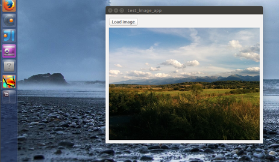

Example of packaging a python app as a .deb using dh-virtualenv
====================================================


Overview
--------

- <a href="http://dh-virtualenv.readthedocs.org/en/0.9/" target="_blank">dh-virtualenv</a> is a very neat way of packaging python into debs with the key advantage that these apps are packaged as
a virtualenv so that the latest packages can be use without relying on the packages on the system... 
But system packages can also be used. A key advantage is that the latest python libraries can be used in a self contained way. 
- The dh-virtualenv documentation mainly focuses on terminal scripts and I couldn't find a good example of packaging an app. 
- So I've included one here that adds a terminal command as well as a desktop shortcut and icon. 
- The example I've used is from a <a href="http://blog.birving.com/2015/09/drag-and-drop-files-into-gui-using.html" target="_blank">previous blog post</a> 
on pyside dragging and dropping

Setup for ubuntu 14.04
-----------------------
- Install the python development packages

```bash
sudo apt-get install python-dev
```

- Create a [virtualenv](https://virtualenv.pypa.io/en/latest/) (so that the latest pip and setuptools  and activate

```bash
virtualenv virt-example
source ~/virt-example/bin/activate
```

- Install the latest dh-virtualenv from source as discussed in step 1 of the 
[dh-virtualenv instructions](http://dh-virtualenv.readthedocs.org/en/0.9/tutorial.html#step-1-install-dh-virtualenv)


Build the example debian package of the GUI
-------------------------------------------
In the folder containing the source

```bash
dpkg-buildpackage -us -uc -b
```

This should build a debian outside the folder

For a full discussion on the setup and files, see the corresponding [blog post](http://blog.birving.com/2015/10/creating-debian-application-from-python.html).


Screenshots
-----------

Install the newly created debian


The icon appears in search


Once launched an icon appears in the dock


The app functions as expected



To uninstall the test app

```bash
sudo apt-get remove ExImView
```

Notes
------

Note that this example doesn't take advantage of the main use of dh-virtualenv, which is packaging the latest dependencies with the app. But this can be done trivially by adding them to the requirements.txt file as explained in the dh-virtualenv documentation. 

Please suggest changes that improve this example
